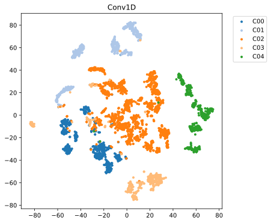

# motion-classification
Code for the walking analysis

## Getting Started
To be updated

## Screenshots


## Bugs or questions?
If you have any questions related to the code or the paper, feel free to email Seung-Chan Kim (`seungk@g.skku.edu`) and Hyeonjoo Kim (`hzoo@g.skku.edu`)

## Citation
Please cite our paper if you use our approach in your work:
```
To-be-updated
```

